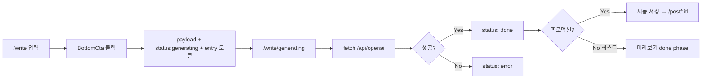
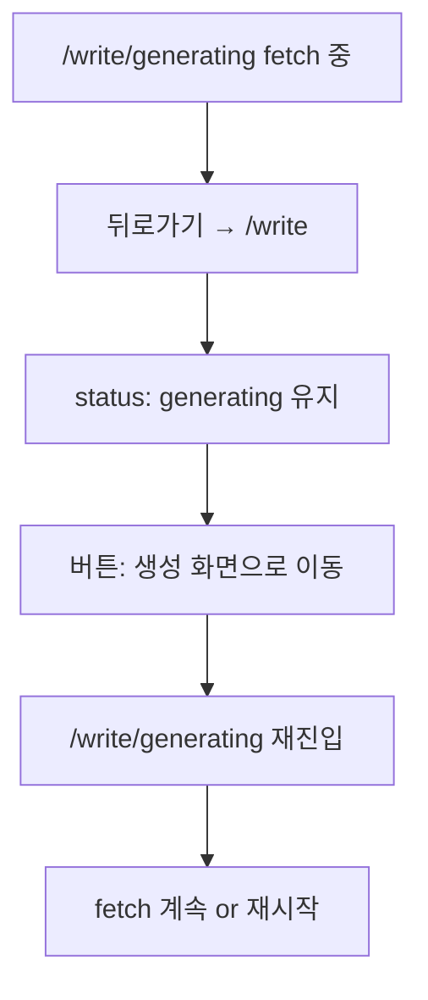

# AI 글 생성 — 이탈·복구 설계 정리 (BlogAi)

> Notion 붙여넣기용 문서  
> 대상 플로우: `/write` → `/write/generating`  
> 최종 갱신: 2026-06-12

---

## 1. 문서 목적

유저가 **글 작성·생성 중 사이트를 나가거나**, **뒤로가기·탭 전환·탭 닫기**를 했을 때:

- 생성 작업을 어떻게 **유지**할지
- 돌아왔을 때 **무엇을 보여줄지**
- **언제 session/DB를 clear**할지

를 정리한 설계 메모입니다.

---

## 2. 한 줄 요약

| 범위                                  | 가능 여부                                      |
| ------------------------------------- | ---------------------------------------------- |
| **같은 탭** 내 뒤로가기·복귀          | ✅ 가능 (`sessionStorage`)                     |
| **탭 닫기** 후 복구                   | ❌ 현재 불가 (session 소멸)                    |
| **로그인 + 프로덕션**                 | ✅ 생성 완료 시 **DB 자동 저장** = 사실상 유지 |
| **URL 직접 입력** `/write/generating` | ❌ 입장 토큰으로 차단 (구현됨)                 |

---

## 3. 브라우저 한계 (먼저 이해)

| 상황                              | sessionStorage | React state          | 서버 fetch               |
| --------------------------------- | -------------- | -------------------- | ------------------------ |
| 같은 탭 `/write` ↔ `/generating`  | ✅ 유지        | ❌ 페이지마다 초기화 | 백그라운드 가능          |
| 다른 사이트 갔다 **같은 탭** 복귀 | ✅ 유지        | ❌ 초기화            | 계속 가능                |
| **탭 닫기 / 브라우저 종료**       | ❌ 소멸        | ❌ 소멸              | 서버는 끝까지 갈 수 있음 |
| **새 탭**에서 URL 입력            | ❌ 공유 안 됨  | —                    | —                        |

> `sessionStorage`는 **탭 단위**입니다. 탭을 닫으면 대부분 데이터가 사라집니다.

---

## 4. 현재 구현 상태 (BlogAi)

### 4.1 sessionStorage 키

| 키                             | 내용                                                     |
| ------------------------------ | -------------------------------------------------------- |
| `self:write-generating`        | 입력값 (템플릿, 제목, 설명, 키워드)                      |
| `self:write-generation-status` | `generating` / `done` / `error`                          |
| `self:write-generating-entry`  | `/write/generating` **입장 토큰** (BottomCta에서만 발급) |

### 4.2 관련 파일

| 파일                        | 역할                                     |
| --------------------------- | ---------------------------------------- |
| `writeGeneratingSession.ts` | payload / status / entry 읽기·쓰기·clear |
| `useGenerationStatus.ts`    | session status → React UI 동기화         |
| `BottomCta.tsx`             | 생성 시작, 입장 토큰 발급, 버튼 UX       |
| `useArticleGeneration.ts`   | fetch + status 갱신                      |
| `useGeneratingDraft.ts`     | phase 관리, 입장 검증, 자동 저장         |
| `proxy.ts`                  | `/write/*` 로그인 보호 (프로덕션)        |
| `saveGeneratedArticle.ts`   | 저장 성공 시 session clear               |

### 4.3 이미 구현된 것 ✅

- [x] `/write`에서 **생성 중** UI (`generating` → "생성 화면으로 이동")
- [x] **생성 완료** UI (`done` → "생성 결과 보기")
- [x] 생성 중 **중복 클릭** 방지 (토스트 / 이동만)
- [x] **URL 직접 진입** 차단 (`grantGeneratingPageEntry` / `hasGeneratingPageEntry`)
- [x] **프로덕션:** 로그인 + API 인증 + **자동 저장**
- [x] **다시 생성** 시 session clear
- [x] **저장 성공** 시 session clear

### 4.4 아직 없는 것 ❌

- [ ] 생성 **결과 본문** session 캐시 (`result`) → 재진입 시 API 재호출 가능
- [ ] **payloadKey** (입력 변경 vs 이전 job 구분)
- [ ] session **TTL** (오래된 `generating` stuck 방지)
- [ ] **탭 닫기** 경고 (`beforeunload`)
- [ ] **inflight dedupe** (동일 payload fetch 1회만)
- [ ] **탭 닫아도** 복구 (localStorage / 서버 job)

---

## 5. 플로우 다이어그램

### 5.1 정상 생성 플로우



### 5.2 뒤로가기 시



---

## 6. 시나리오별 고려사항

### 6.1 생성 **중** — 뒤로가기 / 다른 페이지 (같은 탭)

| 항목          | 현재                     | 개선안                        |
| ------------- | ------------------------ | ----------------------------- |
| fetch 계속    | ✅ (Abort 없음)          | inflight dedupe로 중복만 방지 |
| `/write` UI   | ✅ generating 표시       | —                             |
| 재진입        | ✅ entry 토큰 + status   | result 캐시 불필요            |
| 토큰/API 비용 | 나가도 서버는 돌 수 있음 | Abort는 "유지"와 상충         |

**UX 권장**

- 생성 중: 버튼 → **"생성 화면으로 이동"** (토스트만 X, 이동 O)
- 안내: "생성 중입니다. 버튼을 눌러 진행 화면으로 이동하세요."

---

### 6.2 생성 **완료 후** — 뒤로가기

| 항목     | 현재                                 | 개선안                      |
| -------- | ------------------------------------ | --------------------------- |
| status   | `done` 유지                          | —                           |
| 글 본문  | React state만 (페이지 벗어나면 소실) | **session에 `result` 캐시** |
| 재진입   | fetch **다시** 돌 수 있음            | 캐시 있으면 fetch skip      |
| 프로덕션 | 자동 저장 → DB                       | session clear OK            |

**UX 권장**

- `/write`: **"생성 결과 보기"**
- `/write/generating`: 캐시된 result 즉시 표시

---

### 6.3 **탭 닫기 / 브라우저 종료**

| 항목              | 가능?         | 방법                               |
| ----------------- | ------------- | ---------------------------------- |
| session 복구      | ❌            | —                                  |
| 경고 표시         | 미구현        | `beforeunload` (generating일 때만) |
| 영구 저장         | ✅            | **DB 자동 저장** (로그인·프로덕션) |
| 탭 닫아도 UI 복구 | 서버 job 필요 | `jobId` + 폴링 / localStorage      |

**정책 선택**

- **A. 경고 후 포기** (MVP): "나가면 결과를 확인할 수 없습니다"
- **B. DB 저장** (프로덕션): 로그인 유저는 완료 시 마이페이지에서 확인
- **C. 서버 job** (확장): 탭 닫아도 jobId로 재접속

---

### 6.4 **URL 직접 입력** `/write/generating`

| 항목            | 구현                                       |
| --------------- | ------------------------------------------ |
| 로그인          | `proxy.ts` — `/write/*` 보호               |
| payload 없음    | → `/write` redirect                        |
| entry 토큰 없음 | → `/write` redirect + 토스트               |
| 발급 위치       | `BottomCta` → `grantGeneratingPageEntry()` |

---

## 7. session에 넣을 데이터 (권장 확장)

현재:

```ts
payload + status + entry;
```

추가 권장:

```ts
type GenerationJob = {
  status: "generating" | "done" | "error";
  payloadKey: string; // 입력 fingerprint
  startedAt: number; // TTL용
  result?: GeneratedArticle; // done 시 캐시
  error?: string;
};
```

| 필드         | 용도                               |
| ------------ | ---------------------------------- |
| `payloadKey` | 입력 바뀌면 이전 job 무효          |
| `result`     | 재진입 시 fetch 없이 미리보기      |
| `startedAt`  | 30분 TTL — stuck `generating` 정리 |

---

## 8. session clear 타이밍

| 시점                     | clear?    | 이유                         |
| ------------------------ | --------- | ---------------------------- |
| 생성 **완료 직후**       | ❌        | "결과 보기" / 재진입 깨짐    |
| **저장 성공** (프로덕션) | ✅        | DB에 있음                    |
| **다시 생성**            | ✅        | 새 job                       |
| **새 글 생성 시작**      | ✅ (권장) | 이전 job 잔여 제거           |
| **TTL 만료**             | ✅        | `generating` 영구 stuck 방지 |
| **결과 본 뒤 이탈**      | 선택      | UX 정책                      |

### 테스트 모드 vs 프로덕션

|               | 테스트 (`SKIP_LOGIN_FOR_AI_TEST = true`) | 프로덕션 (`false`) |
| ------------- | ---------------------------------------- | ------------------ |
| 저장          | ❌ 미리보기만                            | ✅ 자동 저장       |
| 완료 후 clear | ❌ (session 남음)                        | ✅ 저장 시 clear   |
| 목적          | API·UI 테스트                            | 실사용             |

---

## 9. 저장소 선택 가이드

| 저장소                  | 탭 닫기 후 | 용량 | 추천 용도                                |
| ----------------------- | ---------- | ---- | ---------------------------------------- |
| **sessionStorage**      | ❌         | ~5MB | status, payload, result 캐시 **(1순위)** |
| **localStorage**        | ✅         | ~5MB | 탭 닫아도 복구 (TTL 필수)                |
| **IndexedDB**           | ✅         | 큼   | 긴 글·다건 job                           |
| **Supabase (DB)**       | ✅         | —    | 로그인 유저 영구 저장 **(프로덕션)**     |
| **서버 job (Redis/DB)** | ✅         | —    | jobId + 폴링 (확장)                      |

---

## 10. 구현 로드맵

### Phase 1 — 같은 탭 복구 강화 (추천 우선)

1. `result` session 캐시 — `done` 시 저장
2. `useArticleGeneration` — 캐시 있으면 fetch skip
3. `payloadKey` — 입력 변경 시 job 무효
4. session **TTL** (예: 30분)

### Phase 2 — 이탈 UX

5. `beforeunload` — `generating`일 때만
6. `/write` **error** 상태 버튼·안내
7. **inflight dedupe** — 중복 API 방지

### Phase 3 — 탭 닫아도 (필요 시)

8. localStorage 이전 또는 **서버 job + jobId**
9. `/api/jobs/:id` 폴링
10. 로그인 유저: 완료 시 **무조건 DB 저장** (현재 프로덕션)

---

## 11. 정책 충돌 정리

| 목표 A               | 목표 B            | 선택                                   |
| -------------------- | ----------------- | -------------------------------------- |
| 나가도 **생성 계속** | **토큰 절약**     | AbortController vs 유지 — 둘 다 완벽 X |
| **결과 보기** 유지   | **session clear** | 완료 직후 clear ❌, 저장/재생성 시 ✅  |
| **테스트** 편의      | **프로덕션** 저장 | `SKIP_LOGIN_FOR_AI_TEST` 플래그        |

---

## 12. 체크리스트 (QA)

### 같은 탭

- [ ] 생성 중 뒤로가기 → `/write`에 "생성 화면으로 이동" 표시
- [ ] 클릭 시 `/write/generating` 진입
- [ ] 생성 완료 → `/write`에 "생성 결과 보기"
- [ ] URL 직접 `/write/generating` → `/write` redirect

### 프로덕션 (로그인)

- [ ] 생성 완료 → 자동 저장 → `/post/:id` 또는 `/mypage`
- [ ] 저장 후 session clear
- [ ] 마이페이지에 글 존재

### 미구현 (Phase 1+)

- [ ] 재진입 시 API 재호출 없이 result 표시
- [ ] 탭 닫기 경고
- [ ] TTL 후 stuck status 정리

---

## 13. 관련 코드 스니펫

### 입장 토큰 (BottomCta)

```ts
const goToGenerating = () => {
  grantGeneratingPageEntry();
  router.push("/write/generating");
};
```

### 입장 검증 (useGeneratingDraft)

```ts
const canEnter = Boolean(
  peekWriteGeneratingPayload() && hasGeneratingPageEntry()
);
if (!canEnter) router.replace("/write");
```

### status 동기화 (useArticleGeneration)

```ts
setGenerationStatus("generating"); // fetch 시작
setGenerationStatus("done"); // 성공
setGenerationStatus("error"); // 실패
```

---

## 14. 참고

- API Route(`route.ts`)에서는 `sessionStorage` 사용 **불가** (서버)
- `useGenerationStatus` = session ↔ React UI **다리**
- AbortController: 현재 **미사용** (이탈 후에도 fetch 지속 가능)

---

## 15. 다음 액션 (팀 합의용)

| 우선순위 | 작업                       | 담당 영역                                        |
| -------- | -------------------------- | ------------------------------------------------ |
| P0       | `result` 캐시 + fetch skip | `writeGeneratingSession`, `useArticleGeneration` |
| P1       | TTL + payloadKey           | `writeGeneratingSession`                         |
| P1       | `beforeunload`             | `useGeneratingDraft`                             |
| P2       | inflight dedupe            | `runArticleGeneration` (신규)                    |
| P3       | 서버 job                   | API + DB 설계                                    |

---

_이 문서는 BlogAi 글 생성 이탈·복구 설계 논의용입니다. 구현 변경 시 함께 업데이트하세요._
